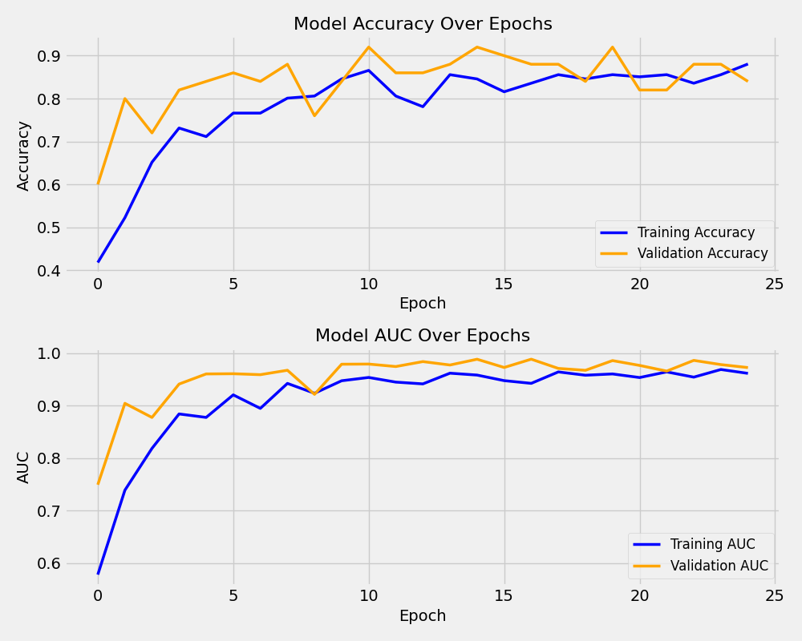
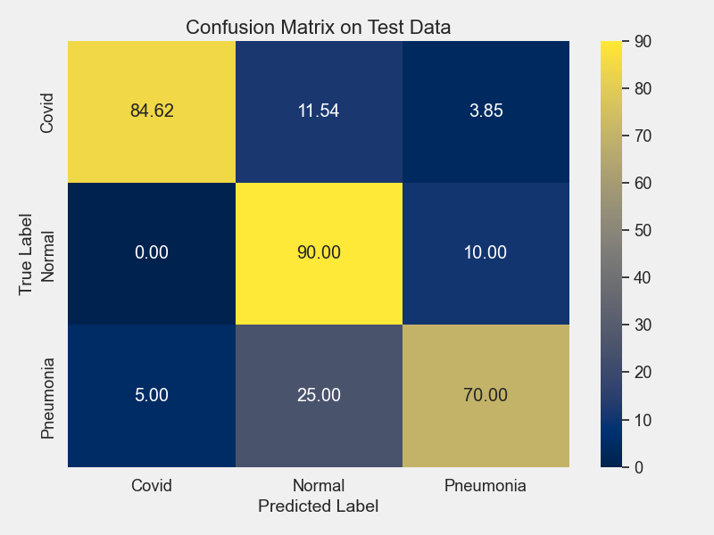

# COVID-19 Chest X-Ray Image Classification

This project builds a Convolutional Neural Network (CNN) to classify chest X-ray images into three categories: **COVID**, **Normal**, and **Pneumonia**. The aim is to assist in the automatic detection of COVID-19 from chest X-ray images.

## Overview

- **Data Preprocessing**: Loading and augmenting the dataset.
- **Model Building**: Constructing a CNN for image classification.
- **Training**: Training the model with early stopping to prevent overfitting.
- **Evaluation**: Assessing the model's performance on unseen test data.
- **Visualization**: Displaying training history and confusion matrices.

A detailed walkthrough is available in the [Jupyter Notebook](covid19_classification.ipynb).

## Dataset

- **Source**: [COVID-19 Image Dataset on Kaggle](https://www.kaggle.com/datasets/pranavraikokte/covid19-image-dataset)
- **Classes**: COVID, Normal, Pneumonia
- **Included**: The dataset is included in this repository for convenience.

## Model Architecture

- **Input**: Grayscale images (256x256 pixels)
- **Convolutional Layers**:
  - **First Block**:
    - Conv2D: 5 filters, 5x5 kernel, stride 3
    - MaxPooling2D: 2x2 pool size, stride 2
    - Dropout: 15%
  - **Second Block**:
    - Conv2D: 3 filters, 3x3 kernel, stride 1
    - MaxPooling2D: 2x2 pool size, stride 2
    - Dropout: 25%
- **Flatten Layer**
- **Output Layer**: Dense layer with 3 units (Softmax activation)

## Results

**Test Performance**:

- **Test Loss**: 0.5310
- **Test Accuracy**: 81.82%
- **Test AUC**: 0.9281

**Classification Report on Test Data:**

| Class            | Precision | Recall  | F1-Score | Support |
|:-----------------|:---------:|:-------:|:--------:|--------:|
| **COVID**        |  0.9565   | 0.8462  |  0.8980  |      26 |
| **Normal**       |  0.6923   | 0.9000  |  0.7826  |      20 |
| **Pneumonia**    |  0.8235   | 0.7000  |  0.7568  |      20 |
| **Accuracy**     |           |         | **0.8182** |     66 |
| **Macro Avg**    |  0.8241   | 0.8154  |  0.8124  |      66 |
| **Weighted Avg** |  0.8362   | 0.8182  |  0.8202  |      66 |

## Visualizations

### Training History

### Confusion Matrix on Test Data

## Conclusion

- **High Precision for COVID Class**: The model accurately identifies COVID cases.
- **Areas for Improvement**: Some misclassifications in Pneumonia and Normal classes.
- **Future Work**: Explore more complex architectures or transfer learning for better performance.

## Acknowledgements

- **Dataset**: Provided by [Pranav Raikokte](https://www.kaggle.com/datasets/pranavraikokte/covid19-image-dataset).
- **Resources**: Thanks to the open-source community.

## License

This project is licensed under the MIT License.

---

**Note**: This project is for educational purposes and should not be used for medical diagnosis.